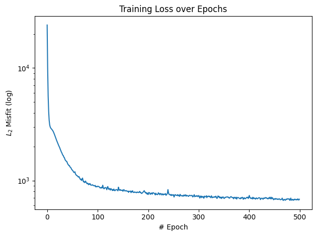
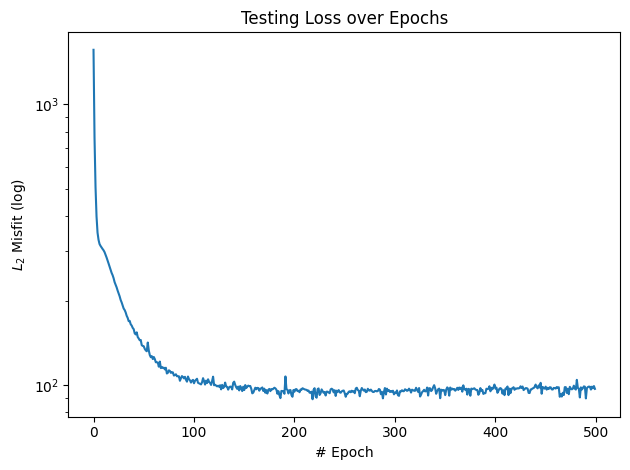
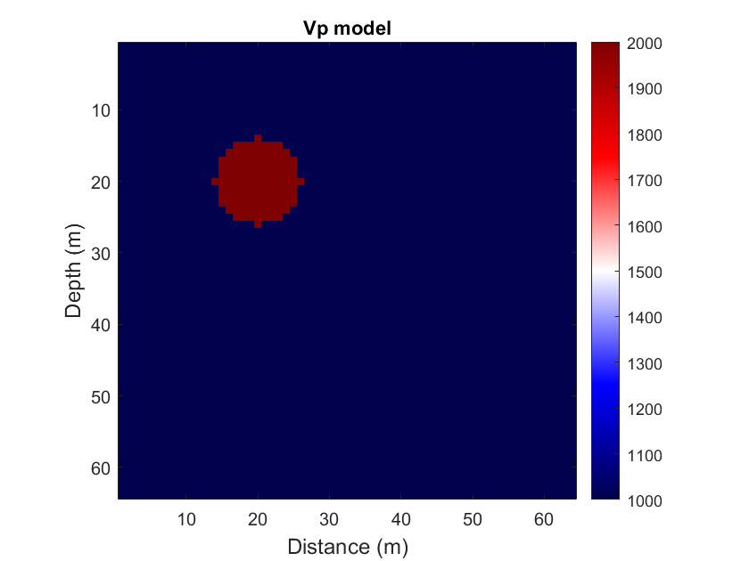
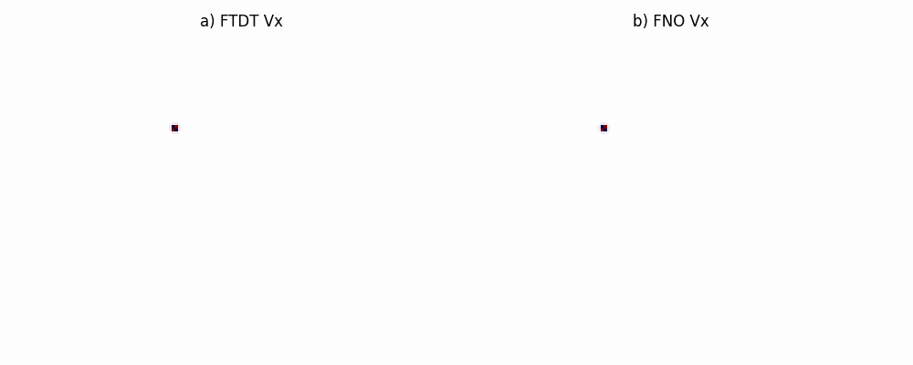

# Geo_Machine__Final_project

# Approximation of Seismic Wave Propagation operator by Fourier Neural Operator (FNO)

This project explores the use of **Fourier Neural Operators (FNO)** to approximate forward seismic wave propagation in 2D velocity models. By learning the mapping from velocity models to seismic wavefields, FNO offers a fast and efficient alternative to traditional finite-difference solvers.

---

## 1. Problem: Forward Seismic Wave Propagation

Forward modeling is a key component in seismic imaging, used to simulate how seismic waves travel through the Earth's subsurface. Traditional methods like finite-difference modeling are computationally expensive, especially when working with large-scale 2D or 3D velocity models.

**Challenges:**
- High computational cost
- Time-consuming simulations
- Difficulty scaling to large datasets

I aim to train a neural operator that can learn this complex physical mapping and generalize across multiple velocity models with similar pattern from FTDT. 

Figure 1. Vx wavefield propagation calculated from FTDT.

---

## 2. Theory: Fourier Neural Operator (FNO)

FNO is a type of neural operator designed to learn mappings between infinite-dimensional function spaces. Unlike traditional CNNs, FNO operates in the **Fourier domain** by applying global convolutions via the Fast Fourier Transform (FFT).

**Key components:**
- Fourier transform → linear transform in frequency domain → inverse FFT
- No need for local kernels like in CNNs
- Captures long-range dependencies efficiently

In this project, I aim to train the model for PSV operator to get the seismic wavefield. I utilized the OCFNO (One-connection FNO)

Figure 2: The structure comparison between original FNO and One-connection FNO. C is convolution; Uₗ and U_l+1 are the input and the output of the lth Fourier layer, respectively; B - bach-normalization operation; $F_c$ and $F_c^{-1}$ are the forward FFT and inverse FFT with respect to the c direction $c \in (x, z)$ in space; $\sigma$ is the activation function; $\kappa_l$ is 1D kernel parameter for the 1D convolution in operation C in the lth Fourier layer. $\theta_{x,l}$ and $\theta_{z,l}$ are the complex weight tensors used for multiplication in the spatial Fourier domain in the lth Fourier layer. The blue arrows indicate the data flow direction and black arrows indicate that parameters are added to the computation (https://library.seg.org/doi/epub/10.1190/geo2022-0268.1).

---

## 3. Training Setup

- **Input:** 2D elastics parameters (`Vp, Vs`, $\rho$) and `Vx` wavefield with  first `it` timesteps. 100 Vs and Vp model used in this project. The velocity model includes homogeneous medium with one high velocity circle inside.
- **Output:** `Vx` Wavefields with 300 timesteps (shape: `[nx, nz, nt]`)
- **Loss function:** MSE between predicted and true wavefields
- **Framework:** PyTorch
+ Training loss

+ Test loss

---

## 4. Results

The trained OCFNO model is named as 'Final_project.ipynb'. 

Speedup: ~3x compared to finite-difference method (2s vs 6s)
Performance:
1. Vp velocity model

2. Comparison of Vx wavefield from FTDT and FNO

---
## 5. Conclusion
+ The Vx wavefield from OCFNO is not similar as one derived from FTDT for later time step. This is attributed to the lack of parameter model and number of dataset to train the model.
+ In the future, with more time and effort, the operator will be better.

---
## 🔗 References
1. [Fourier Neural Operator paper](https://arxiv.org/abs/2010.08895)

2. [Learning to solve the elastic wave equation with Fourier neural operators](https://library.seg.org/doi/epub/10.1190/geo2022-0268.1)

---

