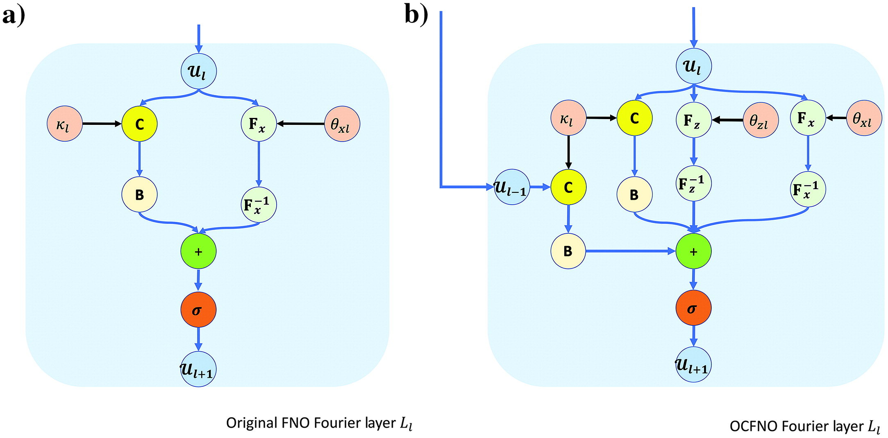

# GeoMachine_project

# Fourier Neural Operator (FNO) for Seismic Wave Propagation

This project explores the use of **Fourier Neural Operators (FNO)** to approximate forward seismic wave propagation in 2D velocity models. By learning the mapping from velocity models to seismic wavefields, FNO offers a fast and efficient alternative to traditional finite-difference solvers.

---

## 1. Problem: Forward Seismic Wave Propagation

Forward modeling is a key component in seismic imaging, used to simulate how seismic waves travel through the Earth's subsurface. Traditional methods like finite-difference modeling are computationally expensive, especially when working with large-scale 2D or 3D velocity models.

**Challenges:**
- High computational cost
- Time-consuming simulations
- Difficulty scaling to large datasets

We aim to train a neural operator that can learn this complex physical mapping and generalize across multiple velocity models.

---

## 2. Theory: Fourier Neural Operator (FNO)

FNO is a type of neural operator designed to learn mappings between infinite-dimensional function spaces. Unlike traditional CNNs, FNO operates in the **Fourier domain** by applying global convolutions via the Fast Fourier Transform (FFT).

**Key components:**
- Fourier transform → linear transform in frequency domain → inverse FFT
- No need for local kernels like in CNNs
- Captures long-range dependencies efficiently

In this project, I aim to train the model for PSV operator to get the seismic wavefield. I utilized the OCFNO (One-connection FNO)

Figure 1: The structure comparison between original FNO and One-connection FNO. C is convolution; Uₗ and U_l+1 are the input and the output of the lth Fourier layer, respectively; B - bach-normalization operation; $F_c$ and $F_c^{-1}$ are the forward FFT and inverse FFT with respect to the c direction $c \in (x, z)$ in space; $\sigma$ is the activation function; $\kappa_l$ is 1D kernel parameter for the 1D convolution in operation C in the lth Fourier layer. $\theta_{x,l}$_

---

## 3. Training Setup

- **Input:** 2D velocity models (shape: `[nx, nz]`)
- **Output:** Wavefields (e.g., `Vx`, shape: `[nx, nz, nt]`)
- **Loss function:** MSE between predicted and true wavefields
- **Data format:** `.mat` files converted to `.pt` for PyTorch
- **Framework:** PyTorch + Neural Operator Library (`neuralop` or custom FNO implementation)

---

## 4. Results

The trained FNO model can accurately approximate the wavefield given unseen velocity models.

Qualitative Comparison:

Performance:

Speedup: ~50x compared to finite-difference method

MSE: ~1e-4 on test set

Generalization: good performance on unseen geological patterns

---
## 5. Conclusion
Fourier Neural Operators provide a powerful tool for approximating wave propagation in geophysics. With minimal runtime and strong generalization, they open new possibilities for:

Real-time modeling

Fast inversion workflows

Large-scale simulations in exploration geophysics

Future work includes extending to 3D models, multi-component wavefields, and inverse problems.

---
## 🔗 References
1. [Fourier Neural Operator paper](https://arxiv.org/abs/2010.08895)

2. [Learning to solve the elastic wave equation with Fourier neural operators](https://library.seg.org/doi/epub/10.1190/geo2022-0268.1)

---

